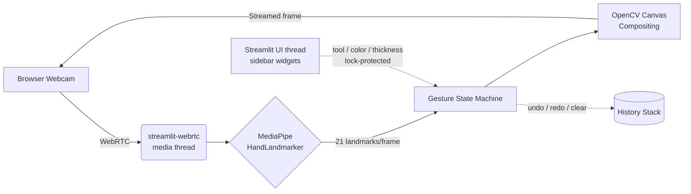

<div align="center">

# AETHER
### Draw on thin air.

Real-time hand-tracked painting in the browser — no mouse, no stylus, no install.

[](https://www.python.org/)
[](https://streamlit.io/)
[](https://ai.google.dev/edge/mediapipe)
[](https://opencv.org/)
[](LICENSE)
[](https://aethervirtualpainter.streamlit.app)


</div>

<br>

## What is this

AETHER tracks your hand through a webcam and turns your **index finger into a paintbrush**. Point at empty space, and a stroke appears — in the browser, in real time, streamed entirely over WebRTC. No desktop install, no drivers, no touchscreen.

It's a from-scratch rebuild of an earlier OpenCV desktop project — redesigned for the web, re-architected for thread safety, and hardened through a real production incident (see [Engineering Notes](#engineering-notes) below, if you like war stories).

<br>

## Features

| | |
|---|---|
| ✏️ **5 drawing tools** | Freehand draw, straight line, rectangle, circle, eraser |
| 🎨 **Color palette** | 6 curated colors, swap instantly mid-stroke |
| 📏 **Adjustable thickness** | 1–30px, live slider |
| ↶ **Undo / Redo** | 25-state history stack |
| ⬇️ **Export** | One-click PNG download, client-side only |
| 🖐️ **Gesture-native** | Index finger = draw, index+middle = reposition — see [gesture reference](#gesture-reference) |
| 🔒 **Privacy-first** | Video is processed in your session only — nothing is recorded, stored, or sent to a server |

<br>

## Live demo

**[→ aethervirtualpainter.streamlit.app](https://aethervirtualpainter.streamlit.app)**

Click **Start**, allow camera access, raise your index finger, and go.

<br>

## Architecture



**The core design constraint:** `streamlit-webrtc` runs video processing on a dedicated media thread, completely separate from Streamlit's UI thread that renders the sidebar. Naively sharing mutable state (the canvas, the hand-tracking model) across that boundary is a race condition waiting to happen.

`PainterProcessor` solves this by keeping the canvas mask, undo history, and MediaPipe model **exclusively on the media thread**. The UI thread only ever touches four small primitives (`tool`, `color`, `thickness`, `pending_action`) behind a single `threading.Lock` — the smallest possible cross-thread surface.

<br>

## Gesture reference

| Gesture | Landmark logic | Effect |
|---|---|---|
| ☝️ Index only | middle fingertip (lm 12) tucked near its base (lm 9) | **Active** — draw / commit the current tool |
| ✌️ Index + middle | middle fingertip raised away from its base | **Idle** — reposition without drawing |

Shapes (line / rectangle / circle) use both states in sequence: two fingers to anchor and aim → one finger to commit.

<br>

## Tech stack

| Layer | Choice | Why |
|---|---|---|
| Hand tracking | **MediaPipe Tasks API** (`HandLandmarker`) | Modern, maintained replacement for the deprecated `solutions` module — the only path compatible with current Python releases |
| Video I/O | **streamlit-webrtc** | Real WebRTC in the browser, not a screenshot-polling hack |
| Compositing | **OpenCV** | Mask-based canvas blending, threshold + bitwise ops |
| UI | **Streamlit** | Sidebar widgets replace the original project's dwell-gesture toolbar — mouse input is more precise than hover-to-select when a mouse is actually available |
| Hosting | **Streamlit Community Cloud** | Free, HTTPS by default (required for browser camera access) |

<br>

## Run it locally

```bash
git clone https://github.com/<your-username>/aether.git
cd aether
pip install -r requirements.txt
streamlit run app.py
```

Open the local URL, click **Start**, allow camera access.

<br>

## Deploy your own

1. Fork this repo
2. Go to [share.streamlit.io](https://share.streamlit.io) → **New app**
3. Point it at `app.py` on your fork's `main` branch
4. Streamlit Cloud auto-installs `requirements.txt` and `packages.txt` (system-level libs OpenCV needs)

First boot takes a few minutes — MediaPipe and OpenCV are chunky installs. Don't panic at "Installing dependencies."

<br>

## Engineering notes

<details>
<summary><b>A breaking upstream API removal, diagnosed and fixed in production</b> (click to expand)</summary>
<br>

Mid-deployment, `mediapipe`'s legacy `solutions` API (used by nearly every hand-tracking tutorial online, including the original version of this project) was removed upstream as of the `1.0.0` release. The app crashed on every WebRTC connection attempt with:

```
AttributeError: module 'mediapipe' has no attribute 'solutions'
```

The obvious-looking fix — pin back to an older `mediapipe` version — turned out to be a dead end: older releases that still have `solutions` don't ship wheels for the newer Python version the host was running, so `pip install` would fail before the code even ran. Confirmed this by bisecting versions locally rather than assuming.

**Real fix:** migrated the detection pipeline to MediaPipe's modern **Tasks API** (`mediapipe.tasks.python.vision.HandLandmarker`) — the maintained replacement, and the only hand-tracking surface available in the version that actually installs on current Python. This meant:
- Manually reproducing the 21-point hand-skeleton drawing (the Tasks API has no `drawing_utils` convenience helper)
- Adding a cached, one-time model download (Tasks-API models aren't bundled in the pip package)
- Verifying every landmark index still mapped correctly (they do — same 21-point topology under the hood)
- Cross-checking the new implementation against Google's own official sample notebook before shipping, not just "it imports without error"

This followed two earlier rounds of production debugging in the same deploy — an apt dependency conflict traced to a Debian package-naming transition (`libglib2.0-0` → `libglib2.0-0t64`), and a runtime `ImportError` for a missing `.so` file resolved by checking actual Debian package contents rather than guessing at library names.

</details>

<br>

## Roadmap

- [ ] Two-hand support (currently capped at 1 for latency on free-tier CPUs)
- [ ] Gesture-based color-cycling as an alternative to the sidebar
- [ ] Session-persistent canvas via `window.storage` for return visits
- [ ] Shareable canvas links

<br>

## License

MIT — see [LICENSE](LICENSE).

<br>

<div align="center">
<sub>Built with MediaPipe, OpenCV, and Streamlit-WebRTC · <a href="https://github.com/<your-username>/aether/issues">Report a bug</a></sub>
</div>
